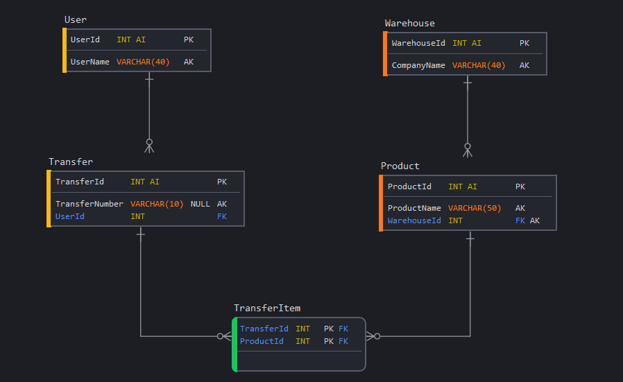

# Spring Boot backend for Warehouse app

Warehouse app - Application for warehouse management.
Warehouse app has users who manage warehouses. There are products in those warehouses. 
These products can be added to transfers - forms for product transportation. (see Database model...)

The purpose of this backend application is to map (create) a database and provide an REST API for secure communication via JWT tokens.
The application also has testing part. Application has multi-layer architecture. 
#### Deploy info
Frontend application is hosted on Webzdarma.cz:
http://warehouse.euweb.cz/

Backend application is deployed on Heroku: 
https://nnpia-warehouse.herokuapp.com/

The application should have some basic data in the database.
- For login try username and password: **admin**
#### Database model

### Spring Boot Security
Application has two not secured (public) endpoints:
- ("/") (IndexController) for request (connection) testing 
- POST ("/api/auth/") (AuthController) with "signin/" or "signup/" post mappings

All other communication is already secured by JWT tokens.

Users also have roles. The user can have the role of administrator or warehouseman or basic user.
## REST Controllers
IndexController and AuthController (see above)
##### ProductController: 
- GET all products
- GET ("/warehouse/{warehouseId}") products by warehouseId
- GET ("{productId}") product by id (ROLE: ROLE_WAREHOUSEMAN or ROLE_ADMIN)
- POST/PUT create or update product (ROLE: ROLE_WAREHOUSEMAN or ROLE_ADMIN)
- DEL ("{productId}") delete product(ROLE: ROLE_ADMIN)
##### TransferController (ROLE: ROLE_WAREHOUSEMAN or ROLE_ADMIN): 
- GET all transfers
- PUT ("/change-state/{transferId}/{state}") change transfer state
- POST ("/confirm/{userId}/{address}") confirm transfer form
- DEL not supported - transfers cannot be removed only canceled!
##### TransferFormController (ROLE: ROLE_WAREHOUSEMAN or ROLE_ADMIN):
- GET transfer form
- POST ("{productId}") add a product to transfer
- DEL ("{productId}") remove product from transfer
- PUT ("{productId}/{amount}") update product to transfer (ROLE: ROLE_ADMIN)
##### UserController (ROLE: ROLE_ADMIN):
- GET all users
- POST/PUT create or update user
- DEL ("{userId}") delete user
##### WarehouseController:
- GET all warehouses
- POST/PUT create or update warehouse (ROLE: ROLE_ADMIN)
- DEL ("{warehouseId}") delete warehouse (ROLE: ROLE_ADMIN)
## Tests
- Two unit tests: ProductRepositoryTests and TransferFormTests
- Two unit tests on controller-view layer: MockMvcProductTest and MockMvcWarehouseTest (MockMvc used)
- Integration test where two services are cooperating: ServicesCooperationTest (Creator used)
- Three Selenium (UI) tests: LoginTests and WarehouseFormTest (Creator used)
## Final note
This application is part of Warehouse app semester work for NNPIA (2021).
For inspiration were used:
- Spring Boot Security and working example JWT authentication https://github.com/petrfilip/spring-boot-jwt
- Spring Boot JWT Authentication example with Spring Security & Spring Data JPA https://github.com/bezkoder/spring-boot-spring-security-jwt-authentication
- React JWT Authentication (without Redux) example https://github.com/bezkoder/react-jwt-auth
- And other repositories and public codes throw internet. All work was done by Bc. Jiří Dřímal.

